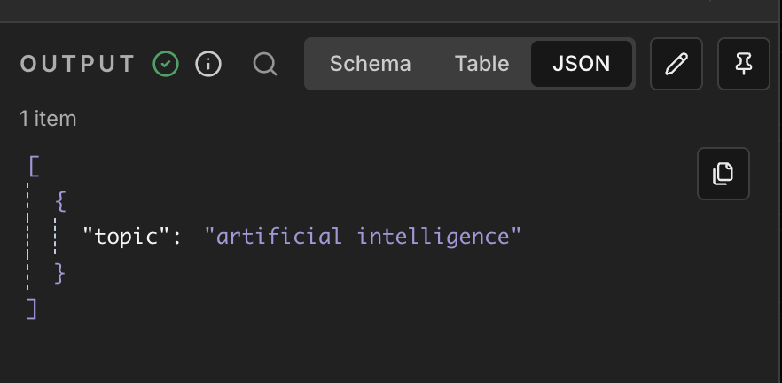
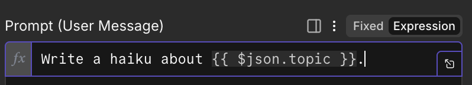

# Quick Start: Your First AI Workflow

In this chapter, you will **build a working AI workflow from scratch**.

No importing files. No theory first. Just building.

**The end result:** you type a topic and the AI explains it in simple words.

> **You type:** `artificial intelligence`
>
> **The AI responds:** *"Artificial intelligence is like teaching a computer to think and learn, kind of like how you learn new things at school. Imagine you have a really smart toy that can look at pictures and tell you if it sees a cat or a dog — that's AI!"*

**The workflow you will build:**

```
┌─────────────────┐     ┌─────────────────┐     ┌─────────────────┐
│  Manual Trigger │────▶│   Edit Fields   │────▶│ Basic LLM Chain │
└─────────────────┘     └─────────────────┘     └─────────────────┘
  (start button)           (your topic)            (asks the AI)
                                                    ┊ (sub-node)
                                                    ┊
                                              ┌───────────┐
                                              │Chat Model │
                                              └───────────┘
                                              (AI provider)
```

Three nodes, three steps:
1. **Manual Trigger** — starts the workflow when you click a button
2. **Edit Fields** — creates the input data (a topic)
3. **Basic LLM Chain** — sends a prompt to the AI and gets a response

---

## Step 1: Create a New Workflow

1. Open n8n in your browser: **http://localhost:5678**
2. Click **Workflows** in the left sidebar
3. Click **Add Workflow** (or the **+** button)

You now see an empty canvas. This is where you build.

**Tip:** Click the workflow name at the top ("My workflow") and rename it to **"My First AI Workflow"**.

---

## Step 2: Add a Trigger

Every workflow needs a **starting point**. This is called a Trigger.

1. Click the **+** button on the canvas (or press `Tab`)
2. Search for **"Manual Trigger"**
3. Click it to add it to your canvas

You should see a node labeled **"When clicking 'Execute workflow'"** (or similar).

**What is this?** The Manual Trigger starts your workflow when you click "Execute Workflow" in the editor. Perfect for learning.

---

## Step 3: Add Input Data

The trigger starts the workflow, but it doesn't create any data. Now add a node that creates our input.

1. Click the **+** button on the right side of the Manual Trigger node
2. Search for **"Edit Fields"** (also called "Set")
3. Click it to add it

Now configure it:

1. In the panel on the right, click **Add Field** → **String**
2. Set **Name** to: `topic`
3. Set **Value** to: `artificial intelligence`

Your configuration should look like:

| Name | Value |
|------|-------|
| topic | artificial intelligence |

**What is this?** The Edit Fields node creates data. We're creating a field called `topic` with a value. This data will flow to the next node.

---

## Step 4: Run It and See the Output

Let's run what we have so far.

1. Click **Execute Workflow** in the top toolbar (or press `Ctrl/Cmd + Enter`)

You should see green checkmarks on both nodes. Now click the **Edit Fields** node.

Look at the **right panel**. This is the **Output Panel** — your best friend for debugging.



You should see:

```json
{
  "topic": "artificial intelligence"
}
```

### The Output Panel

Every time you run a node, you can click it to see:
- **Input** — what the node received
- **Output** — what the node produced

Try clicking the **Table** and **JSON** buttons to switch views. JSON shows the exact field names — you'll need this later.

---

## Step 5: Add the AI Node

Now let's add the node that calls the AI.

1. Click the **+** button on the right side of the Edit Fields node
2. Search for **"Basic LLM Chain"**
3. Click it to add it

You'll see a new node appear, but it has a warning. That's because it needs two things:
- A **Chat Model** (the AI brain)
- A **prompt** (what you want the AI to do)

---

## Step 5b: Set Up Your API Credentials

Before connecting the AI model, you need an API key. We recommend **OpenRouter** — it offers free models with no strict rate limits.

### Option A: OpenRouter (Recommended)

1. Go to [openrouter.ai](https://openrouter.ai/)
2. Sign up (no credit card required for free models)
3. Go to **Keys** → **Create Key**
4. **Copy the API key** (starts with `sk-or-...`)

**Add to n8n:**
1. In n8n, click **Settings** (gear icon, bottom-left)
2. Select **Credentials** → **Add Credential**
3. Search for **"OpenRouter"**
4. Paste your API key → **Save**

### Option B: Google AI Studio (Free but limited)

1. Go to [aistudio.google.com](https://aistudio.google.com/)
2. Sign in with your Google account
3. Click **Get API Key** → **Create API Key**
4. **Copy the API key** (starts with `AIza...`)

**Add to n8n:**
1. In n8n, click **Settings** → **Credentials** → **Add Credential**
2. Search for **"Google Gemini"**
3. Paste your API key → **Save**

**Note:** Google's free tier has strict daily limits (~20-50 requests/day). If you hit rate limit errors, switch to OpenRouter.

Once saved, your credential is available across all workflows.

---

## Step 6: Connect a Chat Model

The Basic LLM Chain needs an AI model to work. Let's connect one.

1. With the Basic LLM Chain selected, look for the **"Chat Model" section** at the bottom
2. Click **+ Chat Model**
3. Choose your provider (OpenRouter recommended)
4. Click the model node that appeared
5. Select the credential you created in the previous step
6. Choose a model:

**OpenRouter (recommended):**
| Type | Model ID |
|------|----------|
| Free | `deepseek/deepseek-chat-v3-0324:free` |
| Cheap | `openai/gpt-4o-mini` |
| Powerful | `anthropic/claude-sonnet-4` |

**Google Gemini:**
| Type | Model ID |
|------|----------|
| Free | `models/gemini-flash-lite-latest` |

You should now see a **dotted line** connecting the Chat Model to the Basic LLM Chain. This means the AI brain is connected.

---

## Step 7: Write Your Prompt

To tell the AI what to do:

1. Click the **Basic LLM Chain** node
2. Find the **Prompt** field
3. In the text area, type:

```
Explain artificial intelligence as if I were 5 years old.
```

This basic approach works. To make it dynamic, use the `topic` field from the Edit Fields node instead of hardcoding text.

### Introducing Expressions

**Expressions** let you use data from previous nodes. The syntax is:

```
{{ $json.fieldName }}
```

Change your prompt to:

```
Explain {{ $json.topic }} as if I were 5 years old.
```

**Important:** Make sure the field is in **Expression mode**. Click the toggle to switch from "Fixed" to "Expression":



**What this does:** When the workflow runs, `{{ $json.topic }}` is replaced with `artificial intelligence` (the value from the Edit Fields node).

---

## Step 8: Run Your Complete Workflow

Time for the big moment!

1. Click **Execute Workflow**
2. Wait a few seconds for the AI to respond
3. Click the **Basic LLM Chain** node

In the Output panel, you should see something like:

```json
{
  "text": "Artificial intelligence is like teaching a computer to think and learn, kind of like how you learn new things at school. Imagine you have a really smart toy that can look at pictures and tell you if it sees a cat or a dog — that's AI! It learns by looking at lots and lots of examples until it gets really good at it."
}
```

**You did it!** You just built an AI workflow from scratch.

Notice the output field is called `text`. This is important — when you want to use this result in another node, you would write `{{ $json.text }}`.

---

## Step 9: Pin Your Data

Every time you run the workflow, the AI generates a new explanation. But what if you want to keep working on the workflow without calling the AI again?

This is where **Pinning** helps.

1. Click the **Basic LLM Chain** node
2. In the Output panel, click the **pin icon** (📌)
3. The node now shows a pin indicator

**What this does:** Next time you run the workflow, this node will use the pinned data instead of calling the AI again. This:
- Saves money (no API call)
- Saves time (instant result)
- Keeps your data consistent while you build downstream nodes

**To unpin:** Click the pin icon again.

**Pro tip:** Pin data after any expensive or slow operation (like AI calls) while you're building.

---

## Step 10: Experiment!

Before moving on, try these experiments:

### Experiment 1: Change the topic
1. Click the **Edit Fields** node
2. Change `artificial intelligence` to `coffee`
3. Unpin the Basic LLM Chain (if pinned)
4. Run the workflow again

### Experiment 2: Add more fields
1. In Edit Fields, add another field: `tone` = `sarcastic`
2. Update your prompt to:
   ```
   Tell me a {{ $json.tone }} joke about {{ $json.topic }}.
   ```
3. Run and see the result

### Experiment 3: Add a System Message
1. In the Basic LLM Chain, find **System Message**
2. Add: `You are a stand-up comedian who always ends with an unexpected twist.`
3. Run and compare the result

**The more you experiment, the faster you'll learn!**

---

## What You Learned

In just a few minutes, you:

| Concept | What you did |
|---------|-------------|
| **Workflow** | Created a sequence of connected nodes |
| **Trigger** | Added a Manual Trigger to start the workflow |
| **Edit Fields** | Created input data with a `topic` field |
| **Basic LLM Chain** | Called an AI model with a prompt |
| **Chat Model** | Connected an AI provider (OpenRouter/OpenAI/Google) |
| **Expression** | Used `{{ $json.topic }}` to pass data between nodes |
| **Output Panel** | Inspected data at each step |
| **Pinning** | Saved output to avoid re-running expensive operations |

These are the core skills you'll use in every workflow.

---

## Your Workflow Structure

<div style="overflow: auto; max-height: 250px; border: 1px solid #ddd; border-radius: 4px; padding: 10px; margin-bottom: 15px; background: #f8f8f8;">
<pre style="margin: 0; white-space: pre;">
┌───────────────────────────────────┐     ┌─────────────────────────────┐     ┌─────────────────────────────┐
│  When clicking 'Execute workflow' │────▶│        Edit Fields          │────▶│      Basic LLM Chain        │
│          (Manual Trigger)         │     │                             │     │                             │
│                                   │     │  topic: "artificial         │     │  Prompt:                    │
│  Output: { }                      │     │          intelligence"      │     │  "Explain {{ $json.topic }} │
│                                   │     │                             │     │   as if I were 5 years old."│
└───────────────────────────────────┘     └─────────────────────────────┘     └─────────────────────────────┘
                                                                                            ┊
                                                                                            ┊ (dotted line)
                                                                                            ┊
                                                                                    ┌───────────────┐
                                                                                    │  Chat Model   │
                                                                                    │  (OpenRouter/ │
                                                                                    │   OpenAI/     │
                                                                                    │   Gemini)     │
                                                                                    └───────────────┘
</pre>
</div>

**Data flow summary:**

| Step | Node | Output |
|------|------|--------|
| 1 | Manual Trigger | `{ }` (empty) |
| 2 | Edit Fields | `{ "topic": "artificial intelligence" }` |
| 3 | Basic LLM Chain | `{ "text": "Artificial intelligence is like teaching a computer to think..." }` |

::::{dropdown} 🔍 See detailed data transformation at each step
:color: info

This diagram shows exactly what data exists after each node runs:

```
 STEP 1                         STEP 2                         STEP 3
┌─────────────────┐            ┌─────────────────┐            ┌─────────────────┐
│  Manual Trigger │───────────▶│   Edit Fields   │───────────▶│ Basic LLM Chain │
└─────────────────┘            └─────────────────┘            └─────────────────┘
        │                             │                              │
        ▼                             ▼                              ▼
┌─────────────────┐            ┌─────────────────┐            ┌─────────────────┐
│                 │            │ {               │            │ {               │
│      { }        │            │   "topic":      │            │   "text":       │
│                 │            │     "artificial │            │     "Artificial │
│   (empty)       │            │      intelligence"           │      intelligence│
│                 │            │ }               │            │      is like    │
│  No data yet.   │            │                 │            │      teaching..."│
│  That's normal! │            │  ✅ We created  │            │ }               │
│                 │            │  our input data │            │                 │
│                 │            │                 │            │  ✅ AI response │
│                 │            │                 │            │  in "text" field│
└─────────────────┘            └─────────────────┘            └─────────────────┘
```

**Key insight:** The Basic LLM Chain outputs to a field called `text`. To use this in the next node, you would write `{{ $json.text }}`.

::::

---

## Common Issues

| Problem | Solution |
|---------|----------|
| "No credentials" error | Go to Settings → Credentials and add your API key |
| Expression shows literally as `{{ $json.topic }}` | Switch the field from "Fixed" to "Expression" mode |
| Output is empty | Check the Output panel on the previous node — is the field name correct? |
| AI response is slow | This is normal. Pin the data while you work on other parts |
| Chat Model not connected | Look for the dotted line. If missing, click + Chat Model again |

---

## Next Steps

Now that you've built your first workflow, you're ready to learn more:

1. **Core Concepts** — Deeper dive into data flow, expressions, and debugging
2. **Workflow Examples** — Four workflow patterns: chaining, routing, parallelization, human-in-the-loop
3. **AI Agent Examples** — Build agents that can use tools and remember conversations

Proceed to the **Core Concepts** chapter to solidify your understanding.
