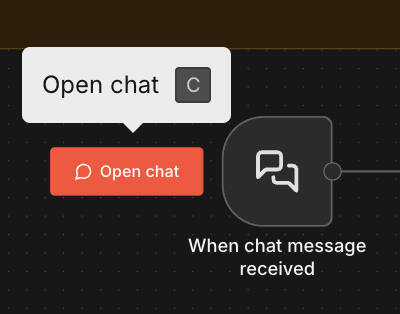

# First AI Agent: Tools and Memory

In this chapter, you will explore AI agents that can decide which tools to use and remember context across turns.

### Workflows in This Chapter

**[Example 1: Calculator + Memory](#example-1-calculator-memory)**

Agent with Calculator + Memory

> **Import URL** (copy with the button on the right, then paste in n8n → Import from URL):
> ```
> https://raw.githubusercontent.com/ezponda/ai-agents-course/main/courses/n8n_no_code/book/_static/workflows/05_ai_agent_basics_calculator_memory.json
> ```
>
> **Download:** {download}`05_ai_agent_basics_calculator_memory.json <_static/workflows/05_ai_agent_basics_calculator_memory.json>`

**[Example 2: Multi-Tool Agent (SerpAPI + Calculator + Think)](#example-2-multi-tool-agent-serpapi-calculator-think)**

Agent with SerpAPI + Calculator + Think

> **Import URL:**
> ```
> https://raw.githubusercontent.com/ezponda/ai-agents-course/main/courses/n8n_no_code/book/_static/workflows/06_ai_agent_tools_serpapi_calculator.json
> ```
>
> **Download:** {download}`06_ai_agent_tools_serpapi_calculator.json <_static/workflows/06_ai_agent_tools_serpapi_calculator.json>`

**[Example 3: Chat Trigger + Memory](#example-3-chat-trigger-memory)**

Chat interface with memory across turns

> **Import URL:**
> ```
> https://raw.githubusercontent.com/ezponda/ai-agents-course/main/courses/n8n_no_code/book/_static/workflows/07_ai_agent_chat_trigger_memory.json
> ```
>
> **Download:** {download}`07_ai_agent_chat_trigger_memory.json <_static/workflows/07_ai_agent_chat_trigger_memory.json>`

**Credentials needed:** OpenRouter API key (Settings → Credentials). Calculator and Think tools need no credentials. **SerpAPI** (used in workflows 06 and 07) requires a free API key from [serpapi.com](https://serpapi.com).

---

## Meet the Node: AI Agent

The **AI Agent** is fundamentally different from the Basic LLM Chain you used in previous chapters.

| Property | Basic LLM Chain | AI Agent |
|----------|-----------------|----------|
| **Execution** | One prompt → one response | Loop: think → act → observe → repeat |
| **Tools** | None | Can call Calculator, SerpAPI, HTTP, etc. |
| **Decision-making** | You control the flow | Agent decides what to do next |
| **Output field** | `text` | `output` |

**Key concept:** The agent can call tools (like Calculator) and decide when it has enough information to answer.

### Sub-Nodes (Connected via Dotted Lines)

The AI Agent uses **sub-nodes** that provide capabilities:

| Sub-node | What it provides | Required? |
|----------|------------------|-----------|
| **Chat Model** | The AI "brain" for reasoning | Yes |
| **Memory** | Remembers conversation history across turns | No |
| **Tools** | Actions the agent can take (Calculator, SerpAPI, etc.) | No |

### Tools You'll Use in This Chapter

| Tool | What it does | Needs credentials? |
|------|--------------|-------------------|
| **Calculator** | Performs arithmetic accurately | No |
| **SerpAPI (Google Search)** | Searches the web for real-time data | Yes (free key at [serpapi.com](https://serpapi.com)) |
| **Think** | A scratchpad for the agent to plan before acting | No |

**See Node Toolbox for full documentation on AI Agent and all tools.**

---

## Example 1: Calculator + Memory

```
┌─────────────────┐     ┌─────────────────┐     ┌─────────────────┐     ┌─────────────────┐
│  Manual Trigger │────▶│   Edit Fields   │────▶│    AI Agent     │────▶│     Output      │
└─────────────────┘     └─────────────────┘     └─────────────────┘     └─────────────────┘
                                                    ┊ (sub-nodes)
                                                    ┊
                                          ┌─────────┴─────────┐
                                          ┊                   ┊
                                    ┌───────────┐  ┌────────┐  ┌────────────┐
                                    │Chat Model │  │ Memory │  │ Calculator │
                                    └───────────┘  └────────┘  └────────────┘
```

**File:** `05_ai_agent_basics_calculator_memory.json`

> **Import via URL** (copy and paste in n8n → Import from URL):
> ```
> https://raw.githubusercontent.com/ezponda/ai-agents-course/main/courses/n8n_no_code/book/_static/workflows/05_ai_agent_basics_calculator_memory.json
> ```
>
> **Download:** {download}`05_ai_agent_basics_calculator_memory.json <_static/workflows/05_ai_agent_basics_calculator_memory.json>`

::::{dropdown} 🛠️ Build this workflow from scratch (step-by-step)
:color: secondary

### Step 1: Create a new workflow

1. Click **Workflows** → **Add Workflow**
2. Rename it to "AI Agent Calculator Practice"

### Step 2: Add the trigger and input

1. Add **Manual Trigger**
2. Add **Edit Fields** → rename to `Input — Agent Prompt`
3. Add two String fields:

| Name | Value |
|------|-------|
| `chatInput` | `A junior data analyst in Madrid earns €24,000/year. What's the monthly net salary after 15% tax?` |
| `sessionId` | `demo` |

### Step 3: Add the AI Agent node

1. Add **AI Agent** → rename to `AI Agent — Calculator + Memory`
2. Configure:
   - **Source for Prompt**: `Define below`
   - **Prompt** (Expression): `{{ $json.chatInput }}`
   - **System Message** (in Options):
     ```
     You are a salary and career advisor.

     Rules:
     - For ANY arithmetic (tax, net salary, comparisons), ALWAYS use the Calculator tool.
     - Keep the final answer short (max 5 lines).
     - Format salary figures with currency symbols.
     ```

### Step 4: Add the Chat Model (sub-node)

1. Click **+ Chat Model** at the bottom of the AI Agent node
2. Select **OpenRouter Chat Model** (or OpenAI, etc.)
3. Choose your credential
4. Model: `openai/gpt-4o-mini`

### Step 5: Add Memory (sub-node)

1. Click **+ Memory** at the bottom of the AI Agent node
2. Select **Window Buffer Memory**
3. Configure:
   - **Session ID Type**: `Custom Key`
   - **Session Key** (Expression): `{{ $json.sessionId }}`
   - **Context Window Length**: `10`

### Step 6: Add Calculator tool (sub-node)

1. Click **+ Tool** at the bottom of the AI Agent node
2. Select **Calculator**
3. No configuration needed

### Step 7: Add Output

1. Add **Edit Fields** → rename to `Output — Answer`
2. Add field:
   - Name: `answer`
   - Value (Expression): `{{ $json.output }}`

### Step 8: Test

1. Click **Execute Workflow**
2. Check the agent used the Calculator tool (not guessing)
3. Try: "My name is Alex. Remember it." then "What is my name?"

::::

### What Problem This Solves

You want an assistant that can do salary math reliably (using a Calculator tool instead of guessing) and remember context across multiple runs (using Memory with a session ID).

### Node-by-Node Walkthrough

<div style="overflow: auto; max-height: 200px; border: 1px solid #ddd; border-radius: 4px; padding: 10px; margin-bottom: 15px; background: #f8f8f8;">
<pre style="margin: 0; white-space: pre;">
┌──────────────────┐     ┌────────────────────────┐     ┌────────────────────────────────┐     ┌──────────────────────┐
│   Manual Trigger │────▶│  Input — Agent Prompt  │────▶│  AI Agent — Calculator+Memory  │────▶│  Output — Answer     │
└──────────────────┘     └────────────────────────┘     └────────────────────────────────┘     └──────────────────────┘
                                                                       ┊
                                                                       ┊ (sub-nodes)
                                                        ┌──────────────┼──────────────┐
                                                        ┊              ┊              ┊
                                                 ┌─────────────┐ ┌───────────┐ ┌────────────┐
                                                 │ Chat Model  │ │  Memory   │ │ Calculator │
                                                 └─────────────┘ └───────────┘ └────────────┘
</pre>
</div>

| Node | Type | What it does |
|------|------|-------------|
| **Manual Trigger** | Trigger | Starts the workflow |
| **Input — Agent Prompt** | Set | Creates `chatInput` and `sessionId` fields |
| **AI Agent — Calculator + Memory** | AI Agent | Receives `{{ $json.chatInput }}`, decides to use tools, outputs `output` |
| **Output — Answer** | Set | Saves `{{ $json.output }}` as `answer` |

**Sub-nodes (dotted lines to the Agent):**

| Sub-node | Type | Purpose |
|----------|------|---------|
| **OpenRouter Chat Model** | Chat Model | Provides the AI "brain" |
| **Simple Memory** | Memory | Remembers last 10 messages using `{{ $json.sessionId }}` |
| **Calculator** | Tool | Performs arithmetic when the agent calls it |

### System Message

```
You are a salary and career advisor.

Rules:
- For ANY arithmetic (tax, net salary, comparisons), ALWAYS use the Calculator tool.
- Keep the final answer short (max 5 lines).
- Format salary figures with currency symbols.
```

**Why "ALWAYS use Calculator"?** LLMs are notoriously bad at math. They often guess wrong, especially with percentages or multi-step calculations. Forcing tool use ensures accuracy.

### Default Value Pattern

The Input node uses a useful pattern for testing:

```
{{ $json.chatInput || "A junior data analyst in Madrid earns €24,000/year. What's the monthly net salary after 15% tax?" }}
```

This means: use incoming `chatInput` if it exists, otherwise fall back to a default test value. Helpful when developing workflows.

### Memory Window

The Simple Memory sub-node has `contextWindowLength: 10`, meaning it only remembers the last 10 messages. Older messages are forgotten.

**Why 10 messages?** Each message consumes tokens from the model's context window. A typical exchange (user question + assistant response) uses 100–500 tokens. With 10 messages, memory stays under ~2,500 tokens — leaving room for the system prompt, tools, and the current question. For longer conversations or complex agents, you may need to reduce this number.

### Data Flow

```
INPUT                          OUTPUT
─────                          ──────
Trigger: { }
    ↓
Input — Agent Prompt: { chatInput: "A junior data analyst in Madrid earns €24,000/year...", sessionId: "demo" }
    ↓
AI Agent (thinks → calls Calculator → reads result): { output: "Monthly net salary: €1,700" }
    ↓
Output — Answer: { answer: "Monthly net salary: €1,700" }
```

### What to Observe

1. Click **Input — Agent Prompt** → see `chatInput` and `sessionId`
2. Click **AI Agent** → see `output` field with the final answer
3. Run again with: `"My name is Alex. Remember it."` → then: `"What is my name?"` (memory works if `sessionId` stays the same)

---

::::{dropdown} 🔍 How does the AI Agent decide to use tools? See the loop
:color: info

Unlike Basic LLM Chain (one call), the AI Agent **loops** until it has enough information:

```
                    ┌─────────────────────────────────────────────┐
                    │              USER QUESTION                  │
                    │  "A junior data analyst in Madrid earns     │
                    │   €24,000/year. Monthly net after 15% tax?" │
                    └─────────────────────────────────────────────┘
                                        │
                                        ▼
                    ┌─────────────────────────────────────────────┐
                    │           AGENT THINKS (Loop 1)             │
                    │  "I need to calculate the net salary.       │
                    │   I should use the Calculator tool."        │
                    └─────────────────────────────────────────────┘
                                        │
                                        ▼
                    ┌─────────────────────────────────────────────┐
                    │           CALLS CALCULATOR TOOL             │
                    │  Input: "24000 * (1 - 0.15) / 12"          │
                    │  Output: 1700                               │
                    └─────────────────────────────────────────────┘
                                        │
                                        ▼
                    ┌─────────────────────────────────────────────┐
                    │           AGENT THINKS (Loop 2)             │
                    │  "Calculator returned 1700.                 │
                    │   I have enough info to answer."            │
                    └─────────────────────────────────────────────┘
                                        │
                                        ▼
                    ┌─────────────────────────────────────────────┐
                    │              FINAL OUTPUT                   │
                    │  { "output": "Monthly net salary: €1,700" } │
                    └─────────────────────────────────────────────┘
```

**Key insight:** The agent made 2 "thinking" loops: first to decide it needs a tool, then to confirm it has enough info. The Calculator gave an accurate answer instead of the LLM guessing.

::::

## Example 2: Multi-Tool Agent (SerpAPI + Calculator + Think)

```
┌─────────────────┐     ┌─────────────────┐     ┌─────────────────┐     ┌─────────────────┐
│  Manual Trigger │────▶│   Edit Fields   │────▶│    AI Agent     │────▶│     Output      │
└─────────────────┘     └─────────────────┘     └─────────────────┘     └─────────────────┘
                                                    ┊ (sub-nodes)
                                                    ┊
                                    ┌───────────────┴───────────────┐
                                    ┊               ┊               ┊
                              ┌───────────┐  ┌───────────┐  ┌───────────────────────┐
                              │Chat Model │  │  Memory   │  │ SerpAPI, Calculator   │
                              └───────────┘  └───────────┘  │       Think           │
                                                            └───────────────────────┘
```

**File:** `06_ai_agent_tools_serpapi_calculator.json`

> **Import via URL** (copy and paste in n8n → Import from URL):
> ```
> https://raw.githubusercontent.com/ezponda/ai-agents-course/main/courses/n8n_no_code/book/_static/workflows/06_ai_agent_tools_serpapi_calculator.json
> ```
>
> **Download:** {download}`06_ai_agent_tools_serpapi_calculator.json <_static/workflows/06_ai_agent_tools_serpapi_calculator.json>`

::::{dropdown} 🛠️ Build this workflow from scratch (step-by-step)
:color: secondary

### Step 1: Create a new workflow

1. Click **Workflows** → **Add Workflow**
2. Rename it to "Salary Research Agent"

### Step 2: Add the trigger and input

1. Add **Manual Trigger**
2. Add **Edit Fields** → rename to `Input — Agent Prompt`
3. Add two String fields:

| Name | Value |
|------|-------|
| `chatInput` | `Search for the average data scientist salary in Spain. Then calculate the monthly net salary after 24% income tax.` |
| `sessionId` | `demo` |

### Step 3: Add the AI Agent node

1. Add **AI Agent** → rename to `AI Agent — Salary Research`
2. Configure:
   - **Source for Prompt**: `Define below`
   - **Prompt** (Expression): `{{ $json.chatInput }}`
   - **System Message** (in Options):
     ```
     You are a salary research assistant.

     Rules:
     - To find salary data, job market info, or company details: use the Google Search tool.
     - For arithmetic (tax calculations, salary comparisons): ALWAYS use Calculator.
     - Use Think briefly (1-2 sentences) to plan before calling tools.
     - Output: short bullets with sources, then the final computed number.
     ```

### Step 4: Add sub-nodes

**Chat Model:**
1. Click **+ Chat Model** → Select **OpenRouter Chat Model**
2. Configure credential and model

**Memory:**
1. Click **+ Memory** → Select **Window Buffer Memory**
2. Session Key: `{{ $json.sessionId }}`, Context Window: `10`

**Tools (add all three):**
1. Click **+ Tool** → Select **SerpAPI** → add your SerpAPI credential (free key from [serpapi.com](https://serpapi.com))
2. Click **+ Tool** → Select **Calculator** (no config needed)
3. Click **+ Tool** → Select **Think** (no config needed)

### Step 5: Add Output

1. Add **Edit Fields** → rename to `Output — Answer`
2. Add field: `answer` = `{{ $json.output }}`

### Step 6: Test

1. Click **Execute Workflow**
2. Expand execution details to see the tool call sequence
3. Verify: Think → SerpAPI → Calculator → final answer

::::

### New Tool: Think

This example introduces the **Think** tool—different from other tools because it doesn't fetch external data or perform actions.

| Property | Description |
|----------|-------------|
| **Purpose** | A reasoning scratchpad where the agent writes its plan |
| **How it helps** | Explicit planning keeps the agent organized on multi-step tasks |
| **Typical usage** | Agent calls Think before calling other tools |

**Example Think output:** "I need to search for the average data scientist salary in Spain first, then calculate the monthly net after 24% tax."

Without Think, agents sometimes jump straight to tools and get confused about the order of operations.

### What Problem This Solves

You want an agent that can search for real salary data (SerpAPI), do math (Calculator), and plan before acting (Think tool). The agent decides which tool to use based on the question.

### Node-by-Node Walkthrough

<div style="overflow: auto; max-height: 220px; border: 1px solid #ddd; border-radius: 4px; padding: 10px; margin-bottom: 15px; background: #f8f8f8;">
<pre style="margin: 0; white-space: pre;">
┌──────────────────┐     ┌────────────────────────┐     ┌──────────────────────────────┐     ┌──────────────────────┐
│   Manual Trigger │────▶│  Input — Agent Prompt  │────▶│  AI Agent — Salary Research  │────▶│  Output — Answer     │
└──────────────────┘     └────────────────────────┘     └──────────────────────────────┘     └──────────────────────┘
                                                                    ┊
                                                                    ┊ (sub-nodes)
                                                 ┌──────────────────┼──────────────────┐
                                                 ┊                  ┊                  ┊
                                          ┌─────────────┐    ┌───────────┐    ┌─────────────────────────────┐
                                          │ Chat Model  │    │  Memory   │    │ SerpAPI, Calculator, Think  │
                                          └─────────────┘    └───────────┘    └─────────────────────────────┘
</pre>
</div>

| Node | Type | What it does |
|------|------|-------------|
| **Manual Trigger** | Trigger | Starts the workflow |
| **Input — Agent Prompt** | Set | Creates `chatInput` and `sessionId` fields |
| **AI Agent — Salary Research** | AI Agent | Receives `{{ $json.chatInput }}`, chooses tools, outputs `output` |
| **Output — Answer** | Set | Saves `{{ $json.output }}` as `answer` |

**Sub-nodes (dotted lines to the Agent):**

| Sub-node | Type | Purpose |
|----------|------|---------|
| **OpenRouter Chat Model** | Chat Model | Provides the AI "brain" |
| **Simple Memory** | Memory | Remembers last 10 messages using `{{ $json.sessionId }}` |
| **SerpAPI** | Tool | Searches Google for salary data, job market info (needs API key) |
| **Calculator** | Tool | Performs arithmetic |
| **Think** | Tool | A "scratchpad" where the agent writes its reasoning |

### System Message

```
You are a salary research assistant.

Rules:
- To find salary data, job market info, or company details: use the Google Search tool.
- For arithmetic (tax calculations, salary comparisons): ALWAYS use Calculator.
- Use Think briefly (1-2 sentences) to plan before calling tools.
- Output: short bullets with sources, then the final computed number.
```

### Example Default Prompt

The workflow's default test question demonstrates multi-tool orchestration:

```
Search for the average data scientist salary in Spain. 
Then calculate the monthly net salary after 24% income tax.
```

This requires: Think (plan) → SerpAPI (search salary data) → Calculator (net salary math) → format answer.

### Data Flow

```
INPUT                          OUTPUT
─────                          ──────
Trigger: { }
    ↓
Input — Agent Prompt: { chatInput: "Search for the average data scientist salary in Spain...", sessionId: "demo" }
    ↓
AI Agent:
  1. Calls Think: "I'll search for the average data scientist salary in Spain, then calculate monthly net after 24% tax."
  2. Calls SerpAPI: finds average salary ~€35,000/year
  3. Calls Calculator: 35000 * (1 - 0.24) / 12 = 2216.67
  4. Formats final answer
    ↓
Output — Answer: { answer: "• Average data scientist salary in Spain: ~€35,000/year\n• Monthly net after 24% tax: €2,216.67" }
```

### What to Observe

1. Click **AI Agent — Salary Research** after execution
2. In the Output panel, expand the execution details to see tool calls in order
3. Look for the Think tool output—it shows the agent's planning step
4. Notice how SerpAPI is called before Calculator (the agent figured out the right order)

---

```{warning}
**Known n8n bug — the Think tool.** On some n8n versions, adding the **Think** tool makes the AI Agent fail with *"Bad request – please check your parameters / Invalid schema for function 'Think'"* whenever the Chat Model is an **OpenAI or OpenRouter** model. The Think tool sends an empty parameter schema (`type: "None"` instead of `type: "object"`), which strict providers reject — so the whole request fails even though the agent never gets to call Think.

**If you hit this, just delete the Think node.** The agent works perfectly without it, and planning still happens inside the agent's loop (the *Think* step of the ReAct loop). See [n8n issue #29353](https://github.com/n8n-io/n8n/issues/29353) and the [community thread](https://community.n8n.io/t/n8n-think-tool-bug/298827).
```

::::{dropdown} 🔍 How does the agent orchestrate multiple tools? See the sequence
:color: info

For complex questions, the agent chains multiple tools in the right order:

```
┌─────────────────────────────────────────────────────────────────────────────────┐
│  QUESTION: "Search for the average data scientist salary in Spain.              │
│             Then calculate the monthly net salary after 24% income tax."        │
└─────────────────────────────────────────────────────────────────────────────────┘
                                        │
                                        ▼
┌─────────────────────────────────────────────────────────────────────────────────┐
│  STEP 1: THINK TOOL                                                             │
│  ─────────────────                                                              │
│  Agent writes: "I need to:                                                      │
│    1. Search Google for the average data scientist salary in Spain              │
│    2. Take the annual figure                                                    │
│    3. Calculate monthly net after 24% tax"                                      │
└─────────────────────────────────────────────────────────────────────────────────┘
                                        │
                                        ▼
┌─────────────────────────────────────────────────────────────────────────────────┐
│  STEP 2: SERPAPI (GOOGLE SEARCH) TOOL                                           │
│  ────────────────────────────────────                                           │
│  Query: "average data scientist salary Spain 2025"                              │
│  Result: "The average data scientist salary in Spain is approximately           │
│           €35,000 per year according to Glassdoor..."                           │
└─────────────────────────────────────────────────────────────────────────────────┘
                                        │
                                        ▼
┌─────────────────────────────────────────────────────────────────────────────────┐
│  STEP 3: CALCULATOR TOOL                                                        │
│  ───────────────────────                                                        │
│  Input: "35000 * (1 - 0.24) / 12"                                              │
│  Result: 2216.67                                                                │
└─────────────────────────────────────────────────────────────────────────────────┘
                                        │
                                        ▼
┌─────────────────────────────────────────────────────────────────────────────────┐
│  FINAL OUTPUT                                                                   │
│  ────────────                                                                   │
│  {                                                                              │
│    "output": "• Average data scientist salary in Spain: ~€35,000/year           │
│               • Monthly net after 24% tax: €2,216.67                            │
│               • Source: Glassdoor salary data"                                  │
│  }                                                                              │
└─────────────────────────────────────────────────────────────────────────────────┘
```

**Key insight:** The Think tool helped the agent plan the sequence. Without it, agents sometimes call Google Search multiple times or forget to do the calculation.

::::

## Example 3: Chat Trigger + Memory

```
┌─────────────────┐     ┌─────────────────┐     ┌─────────────────┐
│  Chat Trigger   │────▶│    AI Agent     │────▶│     Output      │
└─────────────────┘     └─────────────────┘     └─────────────────┘
                            ┊ (sub-nodes)
                            ┊
                  ┌─────────┴──────────────────────┐
                  ┊              ┊                  ┊
            ┌───────────┐  ┌────────┐  ┌───────────────────────────┐
            │Chat Model │  │ Memory │  │ SerpAPI, Calculator, Think│
            └───────────┘  └────────┘  └───────────────────────────┘
```

**File:** `07_ai_agent_chat_trigger_memory.json`

> **Import via URL** (copy and paste in n8n → Import from URL):
> ```
> https://raw.githubusercontent.com/ezponda/ai-agents-course/main/courses/n8n_no_code/book/_static/workflows/07_ai_agent_chat_trigger_memory.json
> ```
>
> **Download:** {download}`07_ai_agent_chat_trigger_memory.json <_static/workflows/07_ai_agent_chat_trigger_memory.json>`

::::{dropdown} 🛠️ Build this workflow from scratch (step-by-step)
:color: secondary

### Step 1: Create a new workflow

1. Click **Workflows** → **Add Workflow**
2. Rename it to "Salary Research Chat"

### Step 2: Add the Chat Trigger

1. Add **Chat Trigger** (search for "When chat message received")
2. Configure:
   - **Mode**: `Webhook` (default)
   - **Response Mode**: `When Last Node Finishes` (look for `responseMode`)

**Important:** The Chat Trigger outputs `chatInput` and `sessionId` automatically.

### Step 3: Add the AI Agent node

1. Add **AI Agent** → rename to `AI Agent — Salary Chat`
2. Configure:
   - **Source for Prompt**: `Define below`
   - **Prompt** (Expression): `{{ $json.chatInput }}`
   - **System Message** (in Options):
     ```
     You are a salary research assistant inside an n8n AI Agent workflow.
     Be concise.
     If the user asks about salaries, job markets, or company info, search Google first.
     If the user asks for arithmetic, use the Calculator tool.
     Use Think to plan multi-step research.
     If the user asks you to remember something, store it in memory and confirm briefly.
     If you don't know, say so.
     ```

### Step 4: Add sub-nodes

**Chat Model:**
1. Click **+ Chat Model** → Select **OpenRouter Chat Model**
2. Configure credential and model

**Memory:**
1. Click **+ Memory** → Select **Window Buffer Memory**
2. Session Key: `{{ $json.sessionId }}`, Context Window: `10`

**Tools (add all three):**
1. Click **+ Tool** → Select **Calculator**
2. Click **+ Tool** → Select **SerpAPI** → add your SerpAPI credential
3. Click **+ Tool** → Select **Think**

### Step 5: Add Output (IMPORTANT: field must be named `output`)

1. Add **Edit Fields** → rename to `Output — Chat Response`
2. Add field:
   - Name: **`output`** (not `answer`!)
   - Value (Expression): `{{ $json.output }}`

**Why `output`?** The Chat Trigger looks for a field named `output` in the last node. Other names show raw JSON.

### Step 6: Test

1. Click **Open chat** button (not "Execute Workflow")
2. Type: "What is the average software engineer salary in Berlin?"
3. Type: "Calculate the monthly net if that's €55,000/year with 30% tax"
4. Type: "Remember that I'm interested in Berlin" → then "What city am I interested in?"

::::

### Meet the Node: Chat Trigger

This example introduces a new trigger: **Chat Trigger** (instead of Manual Trigger).

| Property | Description |
|----------|-------------|
| **Purpose** | Provides a chat interface in n8n |
| **How to use** | Click the **Open chat** button (not "Execute Workflow") |
| **Outputs** | `chatInput` (user message) and `sessionId` (conversation ID) |

**Important configuration:**

| Setting | Value | Why it matters |
|---------|-------|----------------|
| `mode` | `webhook` | Listens for incoming chat messages |
| `responseMode` | `lastNode` | Returns whatever the last node outputs |

**Critical:** When `responseMode` is `lastNode`, the Chat Trigger looks for a field named **`output`** in the last node. If you use a different name (like `answer`), the chat shows raw JSON instead of the response text.

**See the **Node Toolbox** appendix for full documentation.**

### What Problem This Solves

You want a real chat interface (not manual test runs) where a salary research agent remembers the conversation across multiple messages within the same session, and can search for real data and do calculations.

### Node-by-Node Walkthrough

<div style="overflow: auto; max-height: 200px; border: 1px solid #ddd; border-radius: 4px; padding: 10px; margin-bottom: 15px; background: #f8f8f8;">
<pre style="margin: 0; white-space: pre;">
┌───────────────────────────────┐     ┌───────────────────────────────────┐     ┌──────────────────────────┐
│  When chat message received   │────▶│  AI Agent — Salary Chat           │────▶│  Output — Chat Response  │
└───────────────────────────────┘     └───────────────────────────────────┘     └──────────────────────────┘
                                                        ┊
                                                        ┊ (sub-nodes)
                                         ┌──────────────┼──────────────────────────┐
                                         ┊              ┊              ┊           ┊
                                  ┌─────────────┐ ┌───────────┐ ┌────────────┐ ┌────────┐ ┌───────┐
                                  │ Chat Model  │ │  Memory   │ │ Calculator │ │SerpAPI │ │ Think │
                                  └─────────────┘ └───────────┘ └────────────┘ └────────┘ └───────┘
</pre>
</div>

| Node | Type | What it does |
|------|------|-------------|
| **When chat message received** | Chat Trigger | Provides chat UI, outputs `chatInput` and `sessionId` |
| **AI Agent — Salary Chat** | AI Agent | Receives `{{ $json.chatInput }}`, uses memory & tools, outputs `output` |
| **Output — Chat Response** | Set | Saves `{{ $json.output }}` as `output` (required name for chat) |

**Sub-nodes (dotted lines to the Agent):**

| Sub-node | Type | Purpose |
|----------|------|---------|
| **OpenRouter Chat Model** | Chat Model | Provides the AI "brain" |
| **Simple Memory (10 messages)** | Memory | Remembers last 10 messages using `{{ $json.sessionId }}` |
| **Calculator** | Tool | Performs arithmetic |
| **SerpAPI** | Tool | Searches Google for salary data, job market info |
| **Think** | Tool | Plans multi-step research before acting |

### System Message

```
You are a salary research assistant inside an n8n AI Agent workflow.
Be concise.
If the user asks about salaries, job markets, or company info, search Google first.
If the user asks for arithmetic, use the Calculator tool.
Use Think to plan multi-step research.
If the user asks you to remember something, store it in memory and confirm briefly.
If you don't know, say so.
```

### Why the Output Field Must Be Named `output`

This is the most common mistake with Chat Trigger workflows:

| Last node field | Chat UI shows |
|-----------------|---------------|
| `output: "Hello!"` | Hello! |
| `answer: "Hello!"` | `{"answer": "Hello!"}` (raw JSON) |
| `response: "Hello!"` | `{"response": "Hello!"}` (raw JSON) |

The Chat Trigger specifically looks for a field named `output`. That's why the Output node in this workflow saves to `output`, not `answer` like the other examples.

### Data Flow

```
INPUT (from Chat UI)           OUTPUT (to Chat UI)
────────────────────           ───────────────────
Chat Trigger: { chatInput: "What is the average software engineer salary in Berlin?", sessionId: "abc123" }
    ↓
AI Agent (Think → SerpAPI → formats): { output: "The average software engineer salary in Berlin is ~€65,000/year." }
    ↓
Output — Chat Response: { output: "The average software engineer salary in Berlin is ~€65,000/year." }
                              ↑
                     This field name matters!

(next message in same session)
Chat Trigger: { chatInput: "Calculate monthly net with 30% tax", sessionId: "abc123" }
    ↓
AI Agent (reads memory, calls Calculator): { output: "Monthly net: €65,000 × 0.70 / 12 = €3,791.67" }
```

### How to Use

1. Import the workflow
2. Click the **Open chat** button (not "Execute Workflow"):



3. Type messages in the chat interface
4. Memory persists within the same chat session

### What to Observe

1. Send: `"What is the average software engineer salary in Berlin?"`
2. Send: `"Calculate the monthly net if that's €55,000 with 30% tax"` → Agent uses Calculator
3. Send: `"Remember that I'm interested in Berlin"` → then: `"What city am I interested in?"` → Memory recalls
4. Open a new chat session → Memory resets (different `sessionId`)

---

::::{dropdown} 🔍 How does Memory work across chat messages? See the session flow
:color: info

Memory uses `sessionId` to keep conversations separate. Same session = shared memory:

```
┌─────────────────────────────────────────────────────────────────────────────────┐
│                            CHAT SESSION A (sessionId: "abc123")                 │
└─────────────────────────────────────────────────────────────────────────────────┘

  MESSAGE 1                           MESSAGE 2                         MESSAGE 3
┌─────────────────┐                ┌─────────────────┐               ┌─────────────────┐
│ User: "What is  │                │ User: "Calculate│               │ User: "Remember │
│  the average SW │                │  monthly net    │               │  I'm interested │
│  engineer salary│                │  with 30% tax"  │               │  in Berlin"     │
│  in Berlin?"    │                │                 │               │                 │
└─────────────────┘                └─────────────────┘               └─────────────────┘
        │                                  │                                 │
        ▼                                  ▼                                 ▼
┌─────────────────┐                ┌─────────────────┐               ┌─────────────────┐
│ Memory: [ ]     │                │ Memory:         │               │ Memory:         │
│ (empty)         │                │ ["What is the   │               │ ["What is the   │
│                 │                │   average...",  │               │   average...",  │
│                 │                │  "~€65,000/yr"] │               │  "~€65,000/yr", │
│                 │                │                 │               │  "Calculate...",│
│                 │                │                 │               │  "Monthly net:  │
│                 │                │                 │               │   €3,791.67"]   │
└─────────────────┘                └─────────────────┘               └─────────────────┘
        │                                  │                                 │
        ▼                                  ▼                                 ▼
┌─────────────────┐                ┌─────────────────┐               ┌─────────────────┐
│ Agent (SerpAPI):│                │ Agent (Calc):   │               │ Agent: "Got it! │
│ "~€65,000/year" │                │ "Monthly net:   │               │  I'll remember  │
│                 │                │  €3,791.67"     │               │  you're inter-  │
│                 │                │                 │               │  ested in Berlin│
└─────────────────┘                └─────────────────┘               └─────────────────┘


┌─────────────────────────────────────────────────────────────────────────────────┐
│                            CHAT SESSION B (sessionId: "xyz789")                 │
│                                   (NEW WINDOW)                                  │
└─────────────────────────────────────────────────────────────────────────────────┘

  MESSAGE 1
┌─────────────────┐
│ User: "What     │
│  city am I      │
│  interested in?"│
└─────────────────┘
        │
        ▼
┌─────────────────┐
│ Memory: [ ]     │
│ (empty - new    │
│  session!)      │
└─────────────────┘
        │
        ▼
┌─────────────────┐
│ Agent: "I don't │
│  have that info.│
│  You haven't    │
│  told me yet."  │
│                 │
│ No memory of    │
│ Berlin!         │
└─────────────────┘
```

**Key insight:** Opening a new chat window creates a new `sessionId`, so the agent starts fresh with no memory of previous conversations.

::::

## The Agent Loop

When an AI Agent runs, it follows this pattern:

1. **Read** the question and system message
2. **Think:** "Do I need a tool?"
3. **If yes:** Call a tool, read its result
4. **Think:** "Do I have enough info now?"
5. **Repeat** until confident, then output the final answer

This loop is why agents are powerful—they can handle complex questions that require multiple steps or tools.

---

## Memory and Session IDs

Memory uses a **Session ID** to keep conversations separate:

| Session ID | Effect |
|------------|--------|
| Same `sessionId` | Same conversation thread (memory persists) |
| Different `sessionId` | Fresh start (no memory) |

In the example workflows, memory uses `{{ $json.sessionId }}` from the input. This means:
- In Manual Trigger workflows: you control the session ID in the Set node
- In Chat Trigger workflows: n8n generates a unique session ID for each chat window

---

## System Messages Control Agent Behavior

The **System Message** in the AI Agent node defines rules for the agent. Each example in this chapter uses a different system message tailored to its tools. Here's what makes them effective:

Good system messages:
- Tell the agent **when** to use each tool (e.g., "For ANY arithmetic, ALWAYS use the Calculator tool")
- Set **boundaries** (e.g., "max 5 lines", "short bullets with sources")
- Prevent loops (e.g., "search once, then answer")
- Match the agent's role to its available tools

Scroll up to each example's System Message section to see the actual prompts.

---

## Guardrails: Preventing Runaway Agents

Agents loop until they decide they're done. Without limits, a confused agent can loop forever — burning through your API credits. **Always set guardrails.**

Set **Max Iterations** to 5-10 in AI Agent → Settings (gear icon). Add explicit limits in your system message too (e.g., "Search Google at most ONCE per question"). The Guardrails & Safety chapter covers this topic in depth, including approval gates for write actions.

---

## Debugging: Understanding What the Agent Thinks

When an agent gives wrong answers or behaves unexpectedly, you need to see its "thought process." Here's how.

### Reading the Output Panel

After running the workflow, click the **AI Agent** node and examine the Output panel:

1. **Input tab:** Shows what the agent received (`chatInput`, `sessionId`)
2. **Output tab:** Shows the final `output` field
3. **Execution details:** Click to expand and see **every tool call**

### What to Look For

| Symptom | Where to check | Common cause |
|---------|---------------|--------------|
| Wrong answer | Tool call outputs | Tool returned unexpected data |
| Skipped a tool | System message | Rules not explicit enough |
| Used wrong tool | Agent's reasoning | Ambiguous question |
| Hallucinated salary data | Tool calls section | Agent didn't call SerpAPI when it should |

### Example Debug Session

**Problem:** Agent says "Data scientists in Spain earn €50,000" without searching Google.

**Debug steps:**
1. Click AI Agent node → Output panel
2. Expand execution details
3. Look for SerpAPI tool call → **Not found!**
4. **Diagnosis:** Agent used its training data instead of searching
5. **Fix:** Update system message: "For ANY salary or job market question, ALWAYS use the Google Search tool first."

### The "Think" Tool for Transparency

Adding the **Think** tool (see Example 2) makes debugging easier because the agent writes its plan before acting. You can see exactly why it chose each tool.

---

## Common Issues

### Agent Keeps Calling Tools Forever

**Fix:** Set **Max Iterations** (see above) and add boundaries to the system message:
```
Search once for current information, then provide your answer.
Do not search more than twice.
```

### Agent Never Uses Tools

**Fix:** Ask questions that clearly need external data, or make the system message more explicit about when to use tools.

### Chat Response Shows Raw JSON

**Fix:** Ensure the last node outputs a field named `output` (not `answer` or another name). The Chat Trigger expects `output`.

### Memory Doesn't Work

**Fix:** Check that `sessionId` is the same across runs. Different session IDs = different memory contexts.

## Summary

| Concept | What You Learned |
|---------|------------------|
| **AI Agent node** | Loops until it has enough info to answer |
| **Chat Model (sub-node)** | Provides reasoning capability |
| **Tools (sub-nodes)** | Actions the agent can call (Calculator, SerpAPI, Think) |
| **Memory (sub-node)** | Enables conversation continuity via `sessionId` |
| **System Message** | Controls when the agent uses tools and how it responds |
| **Output field** | AI Agent outputs to `output` (not `text` like Basic LLM Chain) |

**Key expression:** `{{ $json.output }}` — how you access the agent's response in the next node.

**Docs:** [AI Agent Node](https://docs.n8n.io/integrations/builtin/cluster-nodes/root-nodes/n8n-nodes-langchain.agent/)
