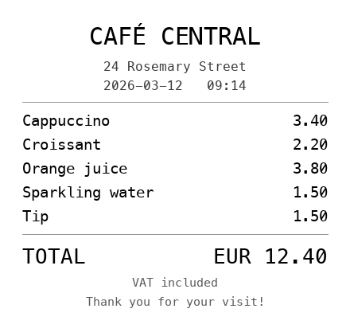
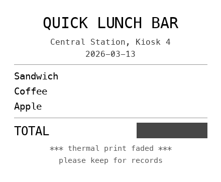
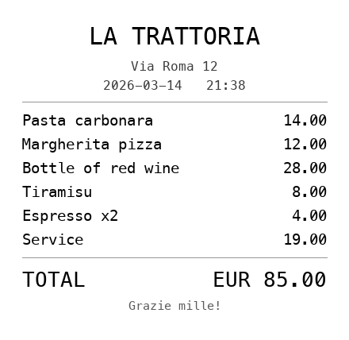

# Project 3: AI Expense Assistant

You've given an agent **tools** (Project 1) and a **code interpreter** (Project 2). Now you give it **eyes**.

Drop a photo of a receipt into a chat and the agent **reads it** — pulls out the vendor, date, total and category — then checks it's readable, not a duplicate, and within company policy, and logs it. If something is off, it *tells you* and asks for a better photo. No forms, no typing, no external accounts: just a conversation with a receipt.

This is a genuinely new capability class: **multimodal** input. And it's a real agent — it *sees*, it *decides* which tool to call (look up past expenses, or save a new one), and it *talks you through* anything wrong.

| What you'll learn | Where it comes from |
|---|---|
| **Multimodal input** — the agent sees an uploaded image | New concept |
| **Chat file uploads** — drop a photo straight into the chat | New (Chat Trigger option) |
| **Data Tables** — a persistent, credential-free store (log + look up) | New here; used again in Project 7 |
| **Agent tools with `$fromAI()`** — the agent fills the row when it decides to log | Builds on First AI Agent + Project 7 |
| **Guarded actions** — validate, de-duplicate and apply policy *before* writing | Builds on Guardrails |

**Workflow in this chapter:**

| File | What it does | GitHub Link |
|------|-------------|-------------|
| `12_expense_assistant.json` | Chat + photo → vision agent reads, checks & logs the receipt | [View](https://github.com/ezponda/ai-agents-course/blob/main/courses/n8n_no_code/book/_static/workflows/12_expense_assistant.json) |

**Requirements:** an **OpenRouter API key** with a **multimodal** model (`openai/gpt-4o-mini` works) and **n8n 1.113+** (Data Tables). No Google, no Gmail — expenses live in an n8n Data Table.

---

## Why a Vision Agent (and why a conversation)?

Two things make expense capture a great fit for an agent with eyes:

**1. The data is a photo.** A receipt is an image, not a form. Asking people to *type* the vendor, date and total is exactly the tedious work we want to remove. A multimodal model reads the picture directly.

**2. Real receipts need checks — and pushback.** Before you save an expense you want to know:
- **Is it readable?** A blurry photo with no visible total shouldn't be logged as "0".
- **Is it a duplicate?** People photograph the same receipt twice.
- **Does it break policy?** A 90 € dinner or an alcohol tab may need a manager's eyes.

A one-shot **form** can't handle this — it takes one submission and it's done; it can't say *"I can't read the total, send a clearer photo"* or *"this looks like a duplicate — are you sure?"*. A **chat agent** can: it sees the image, runs its checks, and **talks back**, and because it has **memory** you can re-send a better photo or confirm in the same conversation.

That conversational loop — see → judge → ask → resolve → log — is the whole point, and it's why this is an *agent*, not a single call.

---

## The Workflow

```
When chat message received ──▶ Expense Agent ──▶ (reply in the chat)
 (Chat Trigger,               (sees the photo, checks, logs)
  file uploads ON)                  ┊ sub-nodes
                       ┌─────────────┼─────────────┬──────────────┐
                  Chat Model      Memory      Find Similar     Log Expense
                  (multimodal)               (Data Table get) (Data Table insert)
```

- **When chat message received (Chat Trigger)** — with **Allow File Uploads** on, so you can drop a receipt photo into the chat. The image arrives as binary data.
- **Expense Agent (AI Agent)** — with **Automatically Passthrough Binary Images** on, it *sees* the photo. It extracts the fields, validates, checks for duplicates, applies policy, and logs — talking to you throughout.
- **Chat Model** — a **multimodal** model (`openai/gpt-4o-mini`); this is what actually "reads" the image.
- **Simple Memory** — so the re-upload / confirmation loop works across turns.
- **Find Similar Expenses (Data Table tool)** — reads past expenses for a vendor, to spot duplicates.
- **Log Expense (Data Table tool)** — inserts the confirmed expense; the agent fills the columns with `$fromAI()`.

**File:** [`12_expense_assistant.json`](https://github.com/ezponda/ai-agents-course/blob/main/courses/n8n_no_code/book/_static/workflows/12_expense_assistant.json)

> **Import via URL** (copy and paste in n8n → Import from URL):
> ```
> https://raw.githubusercontent.com/ezponda/ai-agents-course/main/courses/n8n_no_code/book/_static/workflows/12_expense_assistant.json
> ```
>
> **Download:** {download}`12_expense_assistant.json <_static/workflows/12_expense_assistant.json>`

```{important}
**Setup before the first run:** create a Data Table named exactly `expenses` with these columns (all **String**): `vendor`, `expense_date`, `total`, `currency`, `category`, `status`. The two Data Table tools already point to it **by name**, so there's nothing to select after import. This is a **one-time** step — Data Tables live in your n8n instance, not in the workflow file, so they can't be shipped with the import. (See Step 6.)
```

```{note}
**New here: what is a Data Table?** It's a small database table that lives **inside n8n** — rows and columns, like a spreadsheet, but built for nodes to read and write, and it **persists** across restarts. You pick the columns and their type; each row gets an automatic `id`. Why use it over Google Sheets or a real database? **No credentials and nothing to host** — it's already in n8n and the data stays there. It's not for millions of rows or complex joins (use a real database for that), but it's perfect for an app's little store. We introduce them here and use them again, as agent tools, in Project 7.
```

::::{dropdown} 🛠️ Build this workflow from scratch (step-by-step)
:color: secondary

### Step 1: Create a new workflow
Click **Workflows → Add Workflow**, rename it "Expense Assistant".

### Step 2: Add the Chat Trigger (with uploads)
1. Add **When chat message received** (Chat Trigger).
2. In **Options**, turn on **Allow File Uploads** (this lets you attach a photo in the chat). Leave **Response Mode** at *When Last Node Finishes*.

### Step 3: Add the AI Agent
1. Add **AI Agent** → rename to `Expense Agent`.
2. Configure:
   - **Source for Prompt**: `Define below`; **Prompt** (Expression): `{{ $json.chatInput }}`
   - In **Options**, turn on **Automatically Passthrough Binary Images** (this is what lets the agent see the uploaded photo).
   - **System Message** (in Options): paste the full prompt from the "System Prompt" section below.

### Step 4: Add the Chat Model (must be multimodal)
1. **+ Chat Model** → **OpenRouter Chat Model**, your credential, model `openai/gpt-4o-mini` (it can read images).

### Step 5: Add Memory
1. **+ Memory** → **Simple Memory**: Session ID = Custom Key `{{ $json.sessionId }}`, Context Window `12`.

### Step 6: Create the Data Table
1. **Overview → Data Tables → Create Data Table**, name it `expenses`.
2. Columns (all **String**): `vendor`, `expense_date`, `total`, `currency`, `category`, `status`.
   *Shortcut:* in the create dialog choose **Import CSV** and upload the header template {download}`expenses_template.csv <_static/data/expenses_template.csv>` to create all six columns at once.

### Step 7: Add the "Find Similar Expenses" tool
1. On the agent, **+ Tool → Data Table** → rename `Find Similar Expenses`. Select the `expenses` table. **Operation**: `Get Row(s)`.
2. Filter: column `vendor` **equals** — click the **✨** and set the description to `The vendor / merchant name on the receipt` (→ `$fromAI(...)`).
3. **Tool Description**:
   ```
   Returns past expenses for a given vendor. Each row has vendor, expense_date, total, currency, category, status. Use it to detect duplicates: a duplicate has the SAME vendor, date and total.
   ```

### Step 8: Add the "Log Expense" tool
1. **+ Tool → Data Table** → rename `Log Expense`. Select `expenses`. **Operation**: `Insert Row`.
2. Map the columns (Define Below), each via the **✨** `$fromAI()` button:

| Column | `$fromAI` description |
|--------|----------------------|
| `vendor` | The vendor / merchant name |
| `expense_date` | The receipt date, format YYYY-MM-DD |
| `total` | The total amount as a number, e.g. 12.40 |
| `currency` | Currency code or symbol, e.g. EUR |
| `category` | One of: Meals, Travel, Software, Office, Other |
| `status` | approved or review |

3. **Tool Description**:
   ```
   Adds one expense row to the table. Call it ONLY after the receipt is readable, checked for duplicates, and policy handled.
   ```

### Step 9: Connect
```
When chat message received → Expense Agent
(Chat Model, Simple Memory, Find Similar Expenses, Log Expense connect to the agent as sub-nodes)
```
The agent is the last node, so its reply goes back to the chat.

::::

### Node-by-Node Walkthrough

| Node | Type | What it does |
|------|------|-------------|
| **When chat message received** | Chat Trigger (uploads on) | Chat UI; the uploaded photo arrives as binary |
| **Expense Agent** | AI Agent (image passthrough) | Sees the receipt, validates, de-dupes, applies policy, logs, replies |

**Sub-nodes of the agent:**

| Sub-node | Type | Purpose |
|----------|------|---------|
| **OpenRouter Chat Model** | Chat Model | A **multimodal** model that reads the image |
| **Simple Memory** | Memory | Keeps the re-upload / confirm loop across turns |
| **Find Similar Expenses** | Data Table tool (Get) | Looks up past expenses by vendor to detect duplicates |
| **Log Expense** | Data Table tool (Insert) | Saves the confirmed expense (columns filled via `$fromAI()`) |

### Data Flow

```
Chat: user uploads receipt_cafe_valid.png  → item.binary.data = <image>
    ↓  (passthrough sends the image to the multimodal model)
Expense Agent:
  1. Reads: vendor "Café Central", date 2026-03-12, total 12.40, currency EUR, category Meals
  2. Calls Find Similar Expenses(vendor="Café Central") → []  (no past rows)
  3. Policy: 12.40 meal, no flags → status "approved"
  4. Calls Log Expense(vendor, expense_date, total, currency, category, status)
  → reply: "Logged Café Central, 12.40 EUR (Meals) as approved ✅"
```

::::{dropdown} 🔍 Key insight
:color: info

- **The model has eyes.** With *Passthrough Binary Images* on and a multimodal Chat Model, the uploaded photo is sent to the model — no OCR node, no parsing. The agent reads the receipt like you would.
- **The agent fills the row.** Just like the recipe tool used `$fromAI()` for its query, here the **Log Expense** columns are `$fromAI()` — the agent decides each value from what it saw.
- **Guarantees live in the workflow, not the prompt.** The duplicate lookup is an exact Data Table query; the agent orchestrates it, but the data it compares against is real.

::::

---

## The System Prompt

The whole behaviour — read, validate, de-duplicate, apply policy, log — lives in the system message. Read it as a checklist the agent runs for every receipt.

### Expense Agent — System Message

```
You are an expense assistant for a company. Employees send you a PHOTO of a receipt in the chat, and you log it — but only after you have checked it is readable, not a duplicate, and within policy. You can see the images they send.

The user must type a short text message to send the photo (e.g. "here's a receipt", "aquí tienes"). That note is not important — work from the receipt IMAGE. If a message arrives with NO image at all, ask them to attach the receipt photo.

For each receipt image the user sends:
1. READ it. Extract: vendor (merchant name), expense_date (YYYY-MM-DD), total amount, currency, and a category — one of: Meals, Travel, Software, Office, Other.
2. VALIDATE. If it is not a receipt, or you cannot clearly read the total or the vendor, do NOT log it. Tell the user exactly what is missing and ask them to send a clearer photo.
3. CHECK FOR DUPLICATES. Call "Find Similar Expenses" with the vendor to get their past expenses for that merchant. If one has the SAME date and the SAME total, tell the user it looks like a duplicate and ask them to confirm before you log it.
4. CHECK POLICY. Set status to "review" (otherwise "approved") when any of these apply:
   - a Meals expense is over 50 — also ask the user for a short justification;
   - the receipt is clearly for alcohol or a bar — alcohol is not reimbursable, flag it;
   - the total is over 200.
5. LOG. Once the receipt is readable, not an unconfirmed duplicate, and policy is handled, call "Log Expense" with vendor, expense_date, total, currency, category and status. Then confirm in one friendly line what you logged and its status.

Rules:
- Be concise and friendly — one short paragraph per reply.
- Never invent a field you cannot read; ask instead.
- Call "Log Expense" only once per receipt, after the checks.
- Reply in the user's language.
```

### Why it works

| Element | Why it matters |
|---------|---------------|
| **"You can see the images they send"** | Tells the agent to expect and read a photo (backed by the passthrough option) |
| **Numbered steps (read → validate → dedupe → policy → log)** | A clear procedure keeps a chatty model on rails |
| **"do NOT log it… ask them to send a clearer photo"** | This is the re-upload path — the agent pushes back instead of saving garbage |
| **"call Find Similar Expenses… ask them to confirm"** | Duplicates are caught with a real lookup, then a human confirm |
| **Explicit policy rules + `status`** | The agent flags borderline cases as `review` instead of silently approving |
| **"Call Log Expense only once… after the checks"** | Prevents double-writes and premature logging |

Notice what's *not* here: no fragile "output exactly one word" trick. The agent talks normally, and the structured data goes into the **Log Expense** tool call — the tool's `$fromAI()` fields are the structured output.

---

## Test Scenarios

Four sample receipts ship with the course. **Drag each image straight into the chat** (or download it first, then drop it in). Watch the **Expense Agent → Logs** to see it read the image and call its tools.

<table>
  <tr>
    <td align="center" width="50%">
      <br>
      <a href="_static/data/receipts/receipt_cafe_valid.png" download><b>⬇ receipt_cafe_valid.png</b></a><br>
      <sub><b>1 ·</b> Clean receipt → logged as <b>approved</b></sub>
    </td>
    <td align="center" width="50%">
      <br>
      <a href="_static/data/receipts/receipt_cafe_duplicate.png" download><b>⬇ receipt_cafe_duplicate.png</b></a><br>
      <sub><b>2 ·</b> Same receipt again → <b>duplicate</b>, asks to confirm</sub>
    </td>
  </tr>
  <tr>
    <td align="center" width="50%">
      <br>
      <a href="_static/data/receipts/receipt_incomplete.png" download><b>⬇ receipt_incomplete.png</b></a><br>
      <sub><b>3 ·</b> Unreadable total → asks for a <b>clearer photo</b></sub>
    </td>
    <td align="center" width="50%">
      <br>
      <a href="_static/data/receipts/receipt_dinner_policy.png" download><b>⬇ receipt_dinner_policy.png</b></a><br>
      <sub><b>4 ·</b> Dinner 85 € + wine → flagged for <b>review</b></sub>
    </td>
  </tr>
</table>

```{note}
**How to send a photo in the n8n chat:** you can't send a file on its own — attach the image with the **paperclip**, type a short line (any text, e.g. *"here's a receipt"*), then send. The agent ignores the text and reads the image.
```

Run them **in this order** (the same chat session, so memory and the log build up):

### 1. A clean receipt → logged
Upload **`receipt_cafe_valid.png`** (Café Central, 2026-03-12, 12.40 EUR).
**Expected:** the agent reads it, finds no duplicate, no policy flag, and logs it as **approved**. Open the `expenses` Data Table — the row is there.

### 2. The same receipt again → duplicate
Upload **`receipt_cafe_duplicate.png`** (identical to #1).
**Expected:** the agent calls *Find Similar Expenses*, sees a row with the same vendor + date + total, and **asks you to confirm** before logging. Reply "no, don't log it" and it won't.

### 3. An unreadable receipt → re-upload
Upload **`receipt_incomplete.png`** (no visible total).
**Expected:** the agent says it can't read the total and **asks for a clearer photo** — it does **not** log a zero. This is the validation path.

### 4. A dinner that breaks policy → flagged
Upload **`receipt_dinner_policy.png`** (La Trattoria, 85 EUR, includes wine).
**Expected:** over the 50 € meal limit **and** alcohol, so the agent flags it, asks for a justification, and logs it as **review** (not approved).

> **Bonus (real "wow"):** snap a photo of a real receipt with your phone and drop it in. It reads handwriting, foreign currencies and crumpled paper far better than you'd expect.

---

## What to Observe + Key Takeaways

**1. The model reads the photo directly.** There is no OCR node. A multimodal model + *Passthrough Binary Images* is all it takes — the agent sees the receipt like a person does.

**2. The conversation is the feature.** Because it's a chat with memory, the agent can push back — "send a clearer photo", "confirm this duplicate" — and you resolve it in the same thread. A form couldn't.

**3. The agent decides which tool to use.** It calls *Find Similar Expenses* to check duplicates, then *Log Expense* to save — and only after its checks. That decision-making is what makes it an agent, not a one-shot classifier.

**4. Structured data rides on the tool call.** No output parser needed here: the columns are `$fromAI()`, so the values the agent read become the row it writes. The tool call *is* the structured output.

**5. Guarantees belong in the data, not the prompt.** Duplicate detection is an exact Data Table lookup. The prompt tells the agent to *check*, but the truth comes from the table — the same lesson as the double-booking demo in Project 7.

**6. Data Tables are your credential-free memory.** One `expenses` table, read by one tool and written by another. No Google Sheets, no OAuth — and it persists across restarts.

---

## Try It Yourself

### Challenge 1: Ask your expenses
Add a third Data Table tool, **List Expenses** (Get Row(s), filter `category` = `$fromAI()`), and a line in the system prompt: *"If the user asks about their spending, use List Expenses to answer."* Now the same assistant handles both **capture** ("here's a receipt") and **questions** ("how much have I spent on Meals?").

**Done when:** after logging a few receipts, "how much on Meals so far?" returns a correct total.

### Challenge 2: Approve/Reject buttons (real human-in-the-loop)
For a `review` expense, instead of just logging it, add a **Chat "Send and Wait" (Approval)** step (as in Project 1's variation) so a person clicks **Approve** or **Reject** before it's saved.

**Done when:** a policy-flagged receipt pauses for a button click; a clean one logs straight through.

### Challenge 3: A weekly digest
In a second workflow, a **Schedule Trigger** reads the `expenses` table, filters to `status = review` from the last 7 days, and emails (or Telegrams) the finance team one summary of everything that needs eyes.

**Done when:** a scheduled run produces one digest of the week's flagged expenses.

### Challenge 4: PDF invoices, not just photos
The AI Agent also has **Automatically Passthrough Binary PDFs** (great with models like Gemini). Accept a PDF invoice and extract the same fields.

**Done when:** dropping a PDF invoice logs an expense just like a photo does.

### Challenge 5: Your own policy
Rewrite the policy rules in the system prompt for a real team — per-category limits, required fields, allowed vendors — and test each with a matching receipt (edit one of the samples, or make your own).

**Done when:** each of your rules flags the right receipt as `review`.

## Summary

| Concept | What You Learned |
|---------|------------------|
| **Multimodal input** | With a multimodal Chat Model + *Passthrough Binary Images*, an agent can read an uploaded photo directly — no OCR |
| **Chat file uploads** | The Chat Trigger's *Allow File Uploads* lets users drop images into the conversation |
| **Conversational guardrails** | Memory lets the agent push back — re-upload, confirm a duplicate — instead of blindly saving |
| **Agent tools with `$fromAI()`** | The agent fills a Data Table row itself; the tool call is the structured output |
| **Data Tables** | A persistent, credential-free store — one table, read by one tool and written by another |
| **Deterministic checks** | Duplicate detection is an exact lookup; the prompt orchestrates, the data decides |

**Key ideas:**
- `{{ $json.chatInput }}` — the user's message (the photo rides along as binary)
- **Passthrough Binary Images** (agent option) — sends the uploaded image to the model
- `$fromAI('total', '…', 'string')` — the agent supplies each column value when it logs
- A multimodal model (e.g. `openai/gpt-4o-mini`) is required — a text-only model can't see the image

**Docs:**
- [Chat Trigger](https://docs.n8n.io/integrations/builtin/core-nodes/n8n-nodes-langchain.chattrigger/)
- [AI Agent](https://docs.n8n.io/integrations/builtin/cluster-nodes/root-nodes/n8n-nodes-langchain.agent/)
- [Data Tables](https://docs.n8n.io/data-tables/)
